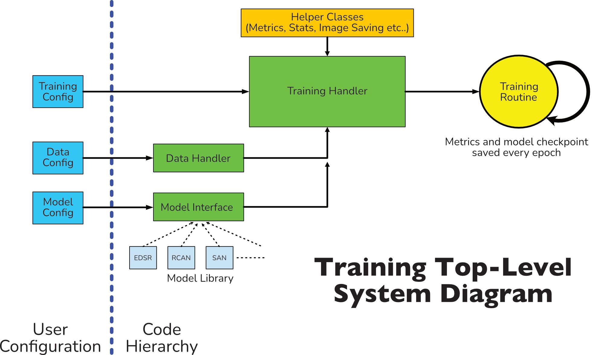

Framework Development
================

This framework has been designed to be modular, to allow for easy modification and prototyping.  

## Adding a new custom model

Adding a new model involves just a few basic steps:
1. Decide on a lowercase symbolic name for your new model (e.g. **basicnet**).
2. Create a new folder in ```Code/SISR/models``` to house your new model.  There are no restrictions on the name of this folder.
3. Initialize this folder by adding a blank ```__init__.py``` file.
4. Create a python file in this folder called ```handlers.py```.
5. Specify a class in this folder called ```*ModelName*Handler```.  This model should inherit from ```BaseModel``` (```from SISR.models import BaseModel```).<br>
   E.g: For model 'basicnet', the handler should be called ```BasicNetHandler(BaseModel)```.
6. This class should call the BaseModel initialization script, define the model's architecture and handle all standard inputs within its constructor.  The following is how this is taken care of for EDSR, a standard SISR model:
```python
class EDSRHandler(BaseModel):
    def __init__(self, device, model_save_dir, eval_mode=False, lr=1e-4, scale=4, in_features=3, hr_data_loc=None,
                 scheduler=None, scheduler_params=None, perceptual=None,
                 num_features=64, num_blocks=16, res_scale=0.1, **kwargs):
        super(EDSRHandler, self).__init__(device=device, model_save_dir=model_save_dir, eval_mode=eval_mode,
                                          hr_data_loc=hr_data_loc, **kwargs)  # calling the BaseModel standard initialization protocol
        self.net = EDSR(scale=scale, in_features=in_features, net_features=num_features, num_blocks=num_blocks,
                        res_scale=res_scale) # initialization of model architecture
        self.colorspace = 'rgb'  # EDSR takes in RGB images directly
        self.im_input = 'unmodified'  # the input image is not modified before use
        self.activate_device()  # standard function to send model to GPU if in use
        self.training_setup(lr, scheduler, scheduler_params, perceptual, device)  # prepares schedulers and optimizers

        self.model_name = 'edsr'  # model name
```
7. To make any changes to the training/eval routine, override ```run_train```, ```run_eval``` or ```run_model``` from the BaseModel.
8. Meta-Models can be easily setup by inheriting from QModel instead (```from SISR.models.attention_manipulators import QModel```)

Examples of models set up with this method can be found in the ```SISR/models``` folder (EDSR (under ```advanced```) is one of the easier models to start off with, while QRCAN (under ```attention_manipulators```) contains an example of a standard meta-network).

## General System Setup

The general training system is set up as shown in the below image.


- The user specifies training, data and model configuration options via a single .toml file (examples in sample_config_files).
- Each of the three sets of configurations get passed to the relevant modules within the training handler.
  - The data configuration options can be analyzed in full in Code/SISR/training/data_setup.py and Code/sr_tools/data_handler.py (this contains the main class for manipulating data).
  - Training config options involve epoch count, early stopping, metric tracking etc, and can be explored in full in Code/SISR/training/training_handler.py.
  - The base model class can be found in Code/SISR/models/\_\_init\_\_.py.  However, each individual model has its own set of configuration options, and these should be explored in the relevant model's handler and architecture classes (more detail on this in the next section).  Additionally, models also have a high-level ModelInterface class (Code/SISR/models/\_\_init\_\_.py), which automates most of the necessary model handling processes. 
- The training handler also uses a variety of external functions from sr_tools such as metric calculations, statistics saving etc.
- Once all setup is complete, the provided config file is copied over to the model result folder, and the training routine starts.  This is a repeated loop of training/testing, running through the entire provided dataset.

## Implemented Model Locations and Placement

Models have been split up into folders according to their category.  The specific models available and their locations are provided below:
- basic **NOTE: These models require images to be pre-upsampled before inserting into model.**
  - SRCNN
  - VDSR
- advanced
  - EDSR
  - RCAN
  - HAN
  - SAN
  - SRMD
- attention_manipulators
  - Q-EDSR
  - Q-RCAN
  - Q-HAN
  - Q-SAN
- SFTMD_variants
  - This contains the basic SFTMD, but this has also been modified to accept a variety of different meta-layers.
- SPARNet
  - Contains both SPARNet and q-SPARNet.
  - Note, images must be first pre-upsampled before inserting into models.

All models which include the insertion of image metadata inherit from QModel (models/attention_manipulators/\_\_init\_\_.py), which contains all the necessary functionality for preparing metadata for insertion into models.
